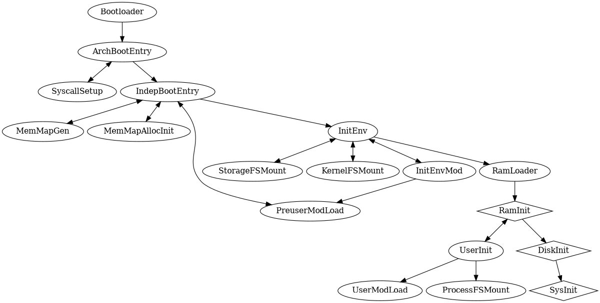

# Boot process

The above diagram represents the boot process, where oval nodes represent kernel items, diamond nodes represent OS items, bidirectional arrows represent items that return to their caller, and directional arrows represent items that don't. 